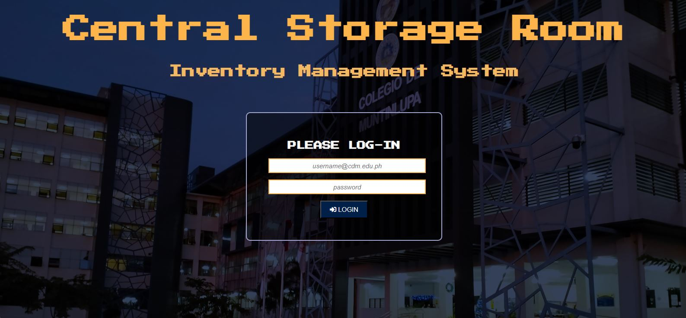
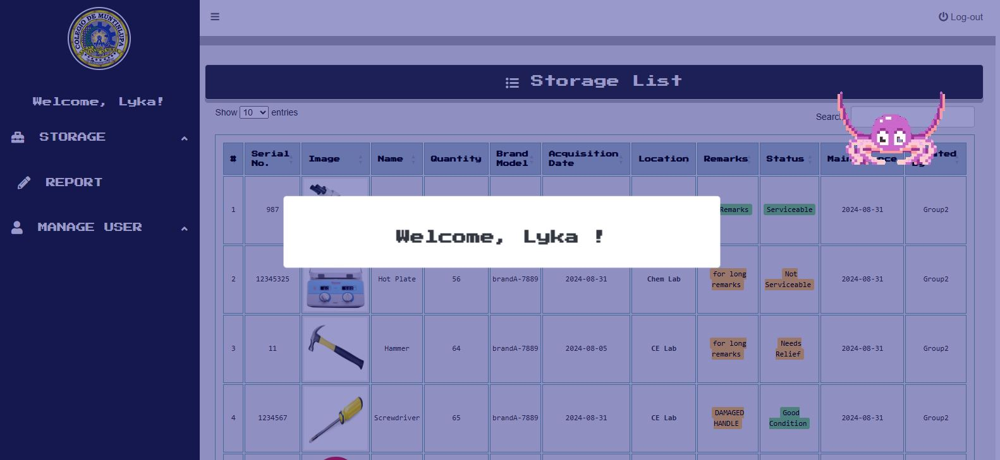
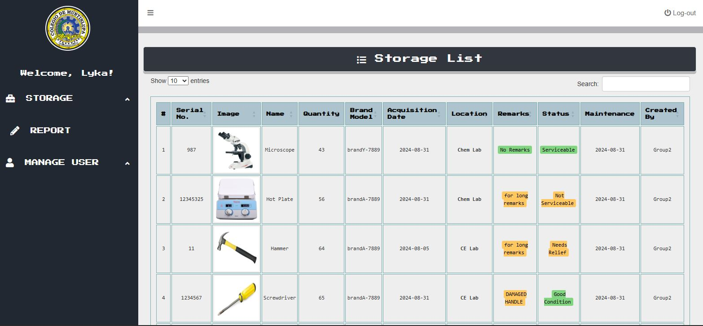
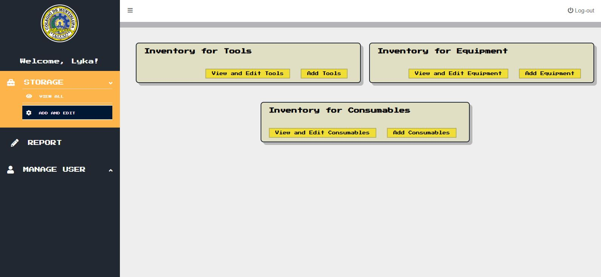
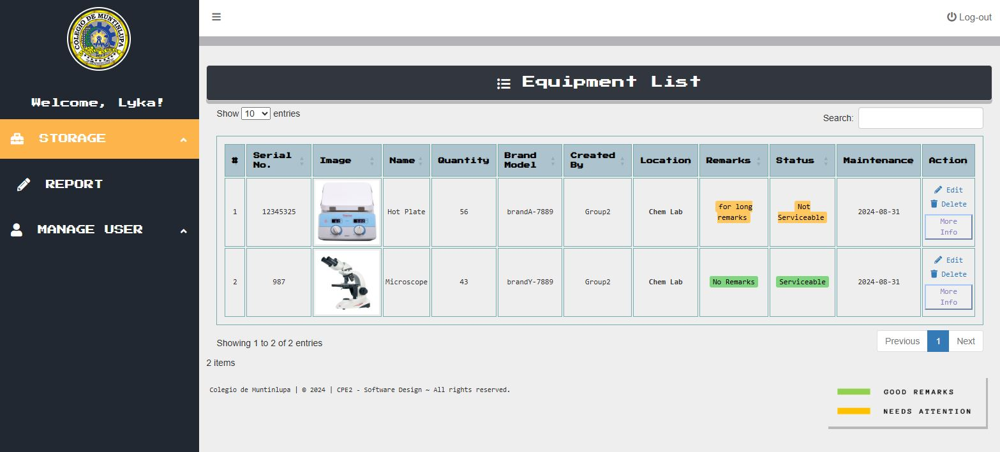
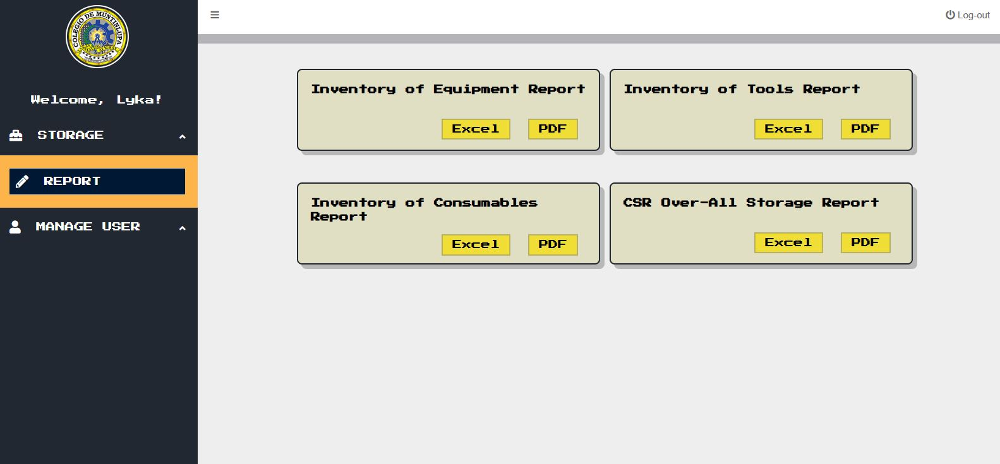
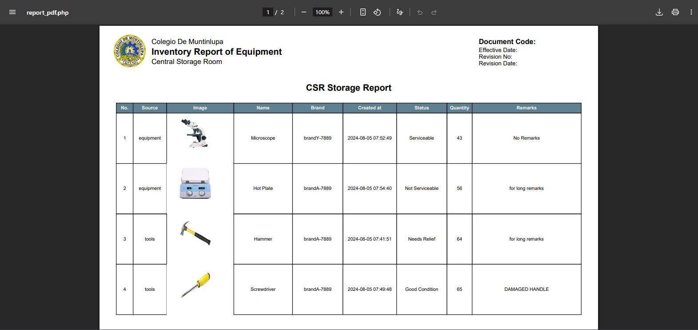

# 📦 University Engineering Inventory Management System (IMS)

A full-stack Web Application designed to digitize and streamline the Central Storage inventory for university Engineering laboratories. This system transitions traditional, manual tracking into an easily accessible digital platform, allowing staff to efficiently manage equipment records and generate professional documentation.

## 📸 System Screenshots
### Log-in Page

### Welcome Page

### Main Dashboard

### Inventory Category

### ADD/EDIT Table

### Export Page

### Export Sample

## ✨ Key Features
* **Full CRUD Functionality:** Easily Add, Read, Update, and Delete equipment records to keep the inventory perfectly up to date.
* **Visual Tracking:** Supports image uploads for each piece of equipment alongside its necessary specifications and details.
* **Professional Reporting:** Built-in export functionality allows users to generate and download inventory lists as **PDF** and **Excel** files for official school documentation and audits.
* **User-Friendly Interface:** A responsive, clean dashboard designed for ease of access by laboratory staff and administrators.

## 🛠️ Tech Stack
* **Frontend:** HTML5, CSS3, JavaScript, Bootstrap (for responsive design)
* **Backend:** PHP
* **Database:** MySQL
* **Environment:** XAMPP Local Server
